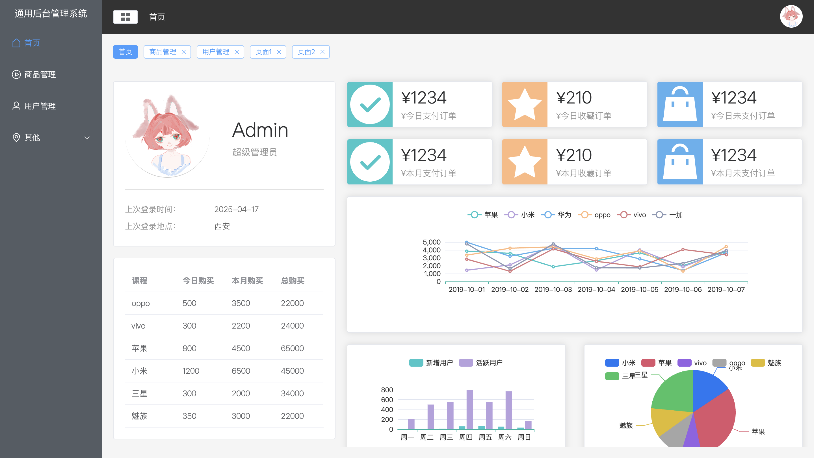
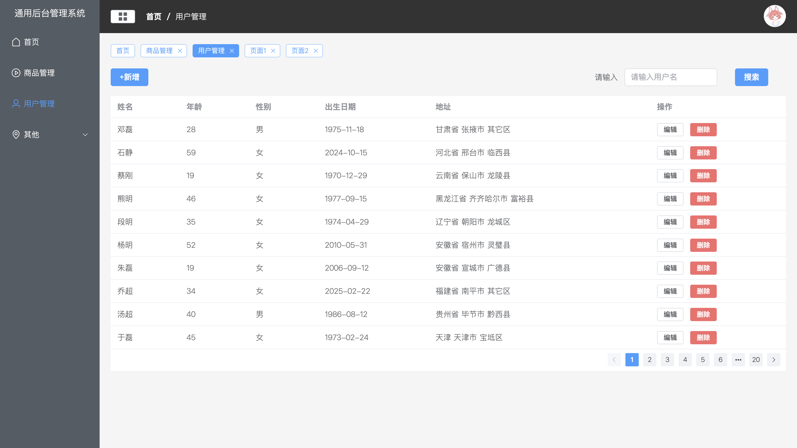

# Vue3 后台管理系统

一个基于 Vue3 + Vite + Element Plus 的现代化后台管理系统。

## 功能特点

- 🎯 基于 Vue3、Vite、Element Plus 最新技术栈开发
- 📦 使用 Pinia 进行状态管理
- 🚦 基于 Vue Router 4 的权限路由
- 🎨 使用 Less 预处理器，支持主题定制
- 📱 响应式布局，支持多端适配
- 🔒 完善的登录/退出功能
- 🎯 动态路由和权限管理
- 📊 集成数据可视化
- 🎨 美观的UI界面

## 主要功能

- 用户登录/退出
- 动态菜单
- 权限管理
- 用户管理
- 商品管理
- 数据统计
- 标签页导航
- 面包屑导航

## 技术栈

- Vue 3
- Vite
- Element Plus
- Pinia
- Vue Router
- Less
- Axios
- Mock.js

## 项目结构

```
vue3-admin-system
├── public/
├── src/
│   ├── api/          # API 接口
│   ├── assets/       # 静态资源
│   ├── components/   # 公共组件
│   ├── config/       # 配置文件
│   ├── router/       # 路由配置
│   ├── stores/       # 状态管理
│   ├── views/        # 页面组件
│   ├── App.vue       # 根组件
│   └── main.js       # 入口文件
├── .gitignore
├── index.html
├── package.json
└── vite.config.js
```

## 快速开始

1. 克隆项目
```bash
git clone https://github.com/Clip117/vue3-admin-system.git
```

2. 安装依赖
```bash
cd vue3-admin-system
npm install
```

3. 启动开发服务器
```bash
npm run dev
```

4. 构建生产版本
```bash
npm run build
```

## 默认账号

- 用户名：admin
- 密码：admin

## 预览

### 登录页面


### 首页


### 用户管理


## 贡献

欢迎提交 Issue 和 Pull Request

## 许可证

[MIT](LICENSE)
